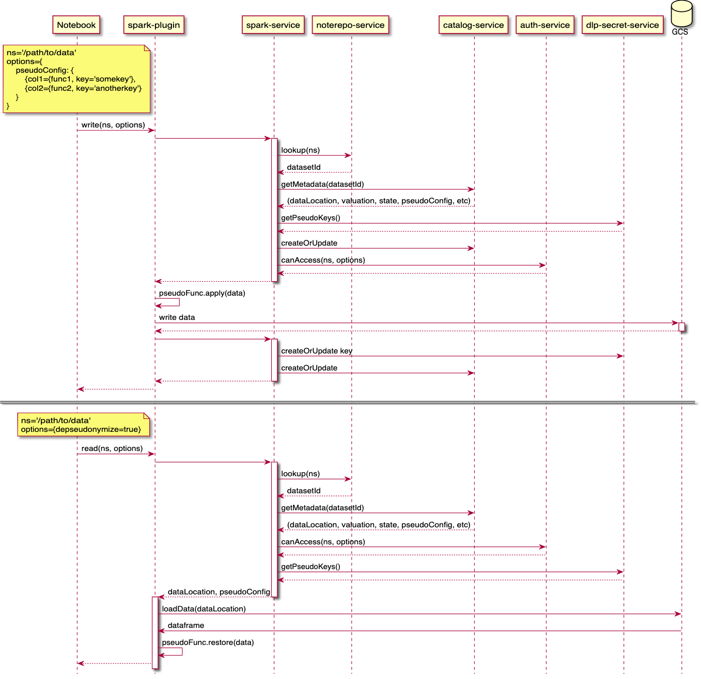

# Dapla Data Loss Prevention

Collection of modules that handle Data Loss Prevention (DLP). This includes pseudonymization functionality.

> Data loss prevention (DLP) is a strategy for making sure that end users do not send sensitive or critical information outside the corporate network. The term is also used to describe software products that help a network administrator control what data end users can transfer.
>
> -- Wikipedia

## Contextual sequence diagram

The following shows components involved in reading and writing pseudonymized data.


<!--

-->

## Development setup

Run `make help` to see common development commands.

```
install                        Checkout all related rawdata-converter repos
update-all                     Pull all changes from remote repos
status-all                     Show a brief summary of local changes
build-all                      Build all
```


## References

* [dapla-dlp-pseudo-lib](https://github.com/statisticsnorway/dapla-dlp-pseudo-lib)
* [dapla-dlp-pseudo-service](https://github.com/statisticsnorway/dapla-dlp-pseudo-service)
